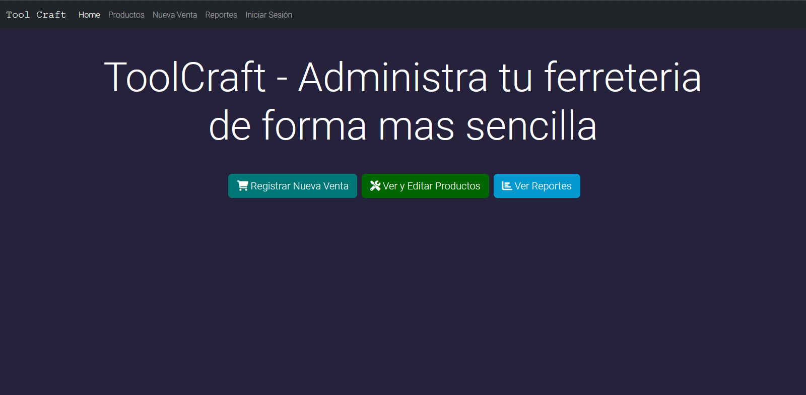
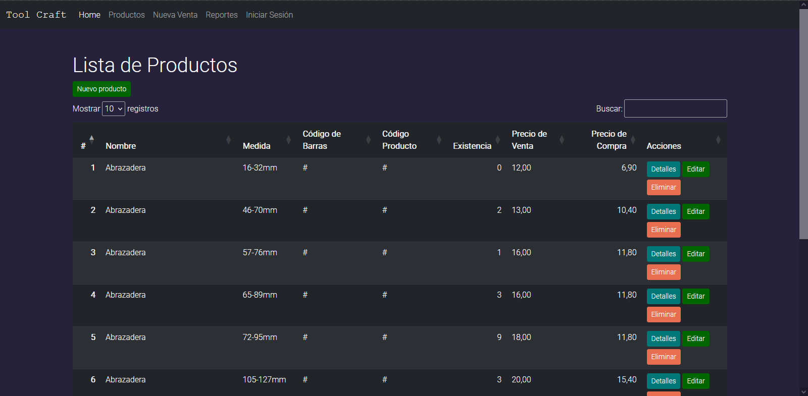
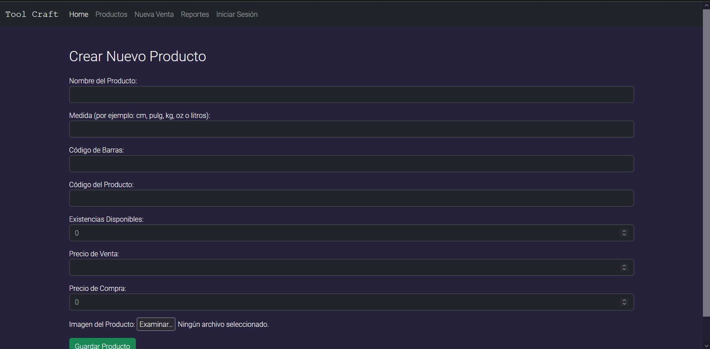
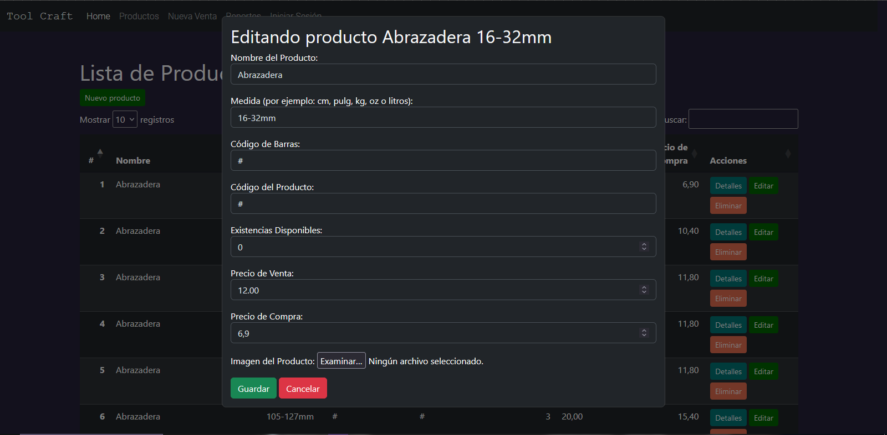
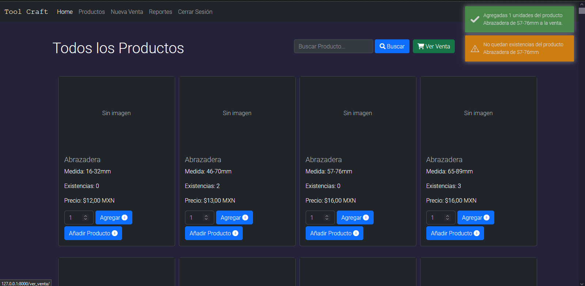

# ToolCraft

**ToolCraft** es una aplicación para la gestión de inventarios, ventas y reportes en un taller de reparaciones. Registrar accesorios y productos, y permite llevar un control eficiente de existencias, puntos de venta, y generar reportes personalizados.

## Características

- **Gestión de Inventarios:** Registro y control de accesorios y productos.
- **Punto de Venta (POS):** Sistema para ventas rápidas y control de ingresos.
- **Reportes:** Generación de reportes de ventas, inventarios y movimientos.
- **Interfaz de Usuario:** Interfaz simple y clara, con diseño en **HTML**, **CSS** y **Bootstrap**.
- **Tecnologías Utilizadas:** Desarrollado con **Django**, con base de datos en **SQLite** y frontend en **Bootstrap**.

## Capturas de Pantalla









## Instalación

Sigue estos pasos para ejecutar ToolCraft en tu máquina local:

1. Clonar el repositorio:
    ```bash
    git clone https://github.com/Etma117/ToolCraft.git
    cd ToolCraft
    ```

2. Crear y activar un entorno virtual:
    ```bash
    python -m venv env
    source env/bin/activate  # En macOS/Linux
    env\Scripts\activate  # En Windows
    ```

3. Instalar las dependencias:
    ```bash
    pip install -r requirements.txt
    ```

4. Aplicar las migraciones de la base de datos:
    ```bash
    python manage.py migrate
    ```

5. Ejecutar el servidor de desarrollo:
    ```bash
    python manage.py runserver
    ```

6. Acceder a la aplicación desde tu navegador en `http://localhost:8000`.

## Uso

### Inventario

1. Accede a la sección de **Inventario** para gestionar tus productos.
2. Usa el formulario para registrar nuevos accesorios.

### Ventas

1. En la sección de **Punto de Venta**, selecciona los productos a vender.
2. Registra las ventas de forma rápida y automática.

### Reportes

1. Genera reportes detallados de inventarios, ventas y movimientos en la sección de **Reportes**.

## Contribuciones

Si deseas contribuir a este proyecto, por favor sigue los siguientes pasos:

1. Haz un fork del repositorio.
2. Crea una rama nueva con tus características o correcciones.
    ```bash
    git checkout -b feature/nueva-caracteristica
    ```
3. Realiza tus cambios y haz un commit.
    ```bash
    git commit -m "Agrega nueva característica"
    ```
4. Sube tus cambios a tu repositorio.
    ```bash
    git push origin feature/nueva-caracteristica
    ```
5. Abre un Pull Request en el repositorio principal.

## Licencia

Este proyecto está licenciado bajo la licencia MIT.

---

### Contacto

Si tienes alguna duda o sugerencia, no dudes en contactarme a través de mi [GitHub](https://github.com/Etma117).

### Servidor de Prueba

Puedes ir a este enlance y probar su funcionamiento: https://toolcraft.onrender.com/
Nota: Dado que es gratuito el servidor, debes esperar de 2 a 3 minutos en lo que inicia el servidor.
